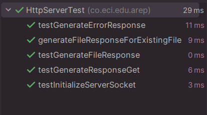

# Servidor HTTP en Java - Taller 01 AREP

Este proyecto es un servidor HTTP simple implementado en Java, sin uso de frameworks.
Puede manejar solicitudes GET y POST, servir archivos estáticos (HTML, CSS, JavaScript, imágenes) y manejar errores de manera adecuada.

## Estructura del Proyecto

El proyecto tiene la siguiente estructura de archivos:
    
    
```src/
└── main/
├──── java/
├───── co.eci.edu.arep
├─────────── EchoClient.java
├─────────── EchoServer.java
├─────────── HttpServer.java    # web server
├─────────── URLParser.java
├─────────── URLReader.java 
├──── resources/
├─────── css/
├────────── styles.css
├────────── error.css
├─────── images/
├────────── rabbit.png  # Imagen de ejemplo png
├────────── cat.jpg     # Imagen de ejemplo jpg
├─────── js/
├────────── script.js
├─────── error.html     # Página de error personalizada
├─────── index.html     # Página principal
└── test/
├──── java/
├───── co.eci.edu.arep
├─────────── HttpServerTest.java
├──── resources/
```

## Características del Servidor

1. Manejo de archivos estáticos:

   - El servidor puede servir archivos HTML, CSS, JavaScript, imágenes y otros archivos estáticos.

   - Los archivos se buscan en la carpeta src/app/.


2. Manejo de errores:

   - Si un archivo no existe, el servidor responde con un error 404 y una página de error personalizada (error.html).

   - Si la página de error no está disponible, se envía un mensaje de error simple en texto plano.


3. Soporte para solicitudes GET y POST:

   - Las solicitudes GET pueden incluir parámetros en la URL (por ejemplo, /data?name=John&age=30).

   - Las solicitudes POST pueden enviar datos en el cuerpo de la solicitud (por ejemplo, desde un formulario).


4. Tipos de contenido (Content-Type):

   - El servidor detecta automáticamente el tipo de contenido basado en la extensión del archivo (por ejemplo, .html, .css, .png).

## Cómo Ejecutar el Servidor

1. Clona el repositorio:

    <pre>
   git clone https://github.com/Andrea2511/AREP-Taller1.git
   cd tu-repositorio</pre>
   
2. Compila el proyecto:

    Asegúrate de tener Java instalado y compila el archivo HttpServer.java:
   
   <pre>
    javac src/co/eci/edu/arep/HttpServer.java</pre>
   
3. Ejecuta el servidor y accede al servidor:

    Abre tu navegador y visita:

    <pre>
    http://localhost:35000/</pre>

    También puedes acceder a otros archivos estáticos, como imágenes o archivos CSS:

    <pre>
    http://localhost:35000/images/rabbit.png
    http://localhost:35000/styles.css</pre>

## Mejoras Implementadas

1. Manejo de archivos binarios:

    El servidor envía archivos binarios (como imágenes) correctamente utilizando FileInputStream.


2. Rutas relativas:

    Se utiliza una ruta base (src/app/) para acceder a los archivos estáticos, lo que hace que el servidor sea más flexible.


3. Validación de rutas:

    Las rutas de los archivos se normalizan para evitar problemas con caracteres inválidos o barras adicionales.


4. Página de error personalizada:

    Si un archivo no existe, el servidor intenta enviar una página de error personalizada (error.html). Si no está disponible, envía un mensaje de error simple.


5. Soporte para tipos de contenido:

    El servidor detecta automáticamente el tipo de contenido basado en la extensión del archivo.

## Ejemplos de Uso

### Solicitud GET

Accede a la página principal:

 <pre>
    http://localhost:35000/</pre>


Accede a una imagen:
    
     <pre>
        http://localhost:35000/images/logo.png</pre>

Accede a un archivo CSS:

    <pre>
    http://localhost:35000/styles.css</pre>

### Solicitud POST

Envía datos desde un formulario HTML, el servidor procesará los datos y devolverá una respuesta JSON, aunque existe un fallo al devolver los datos en formato JSON, por lo que, no los muestra


## Pruebas y Depuración

Pruebas unitarias:

Se implementaron pruebas unitarias para verificar el comportamiento del servidor.

## Build with

- Maven - Dependency Management
- Java - Lenguaje de programación
- Git - Control de versiones



## Versión

1.0

## Deploy


## Autor

Andrea Valentina Torres Tobar


